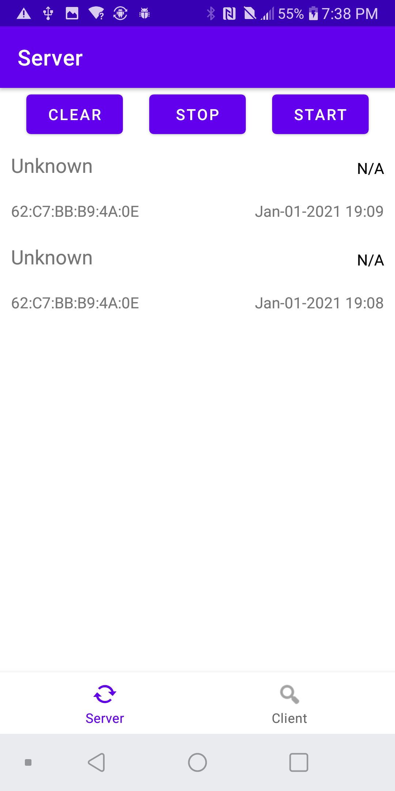
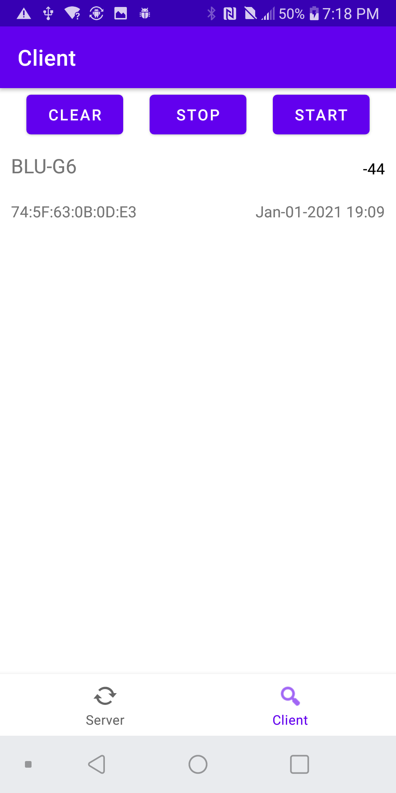

# NearbyBLE
Android app that exchange SHA-256 token using BLE

This app is meant to show some of the new feature of the Jetpack Library such as the use of ViewModel, Data Binding, Navigation features and Room. 

There are two mode: client and server. The app cannot scan a serve at the same time.

# Description
The gatt server serves on a particular UUID; there are 2 characteristics: one to server the server token which is read-only, and another containing a descriptor which the client can write its token.
The new found devices are saved in a room database and displayed in two fragments. 

## Screenshots

